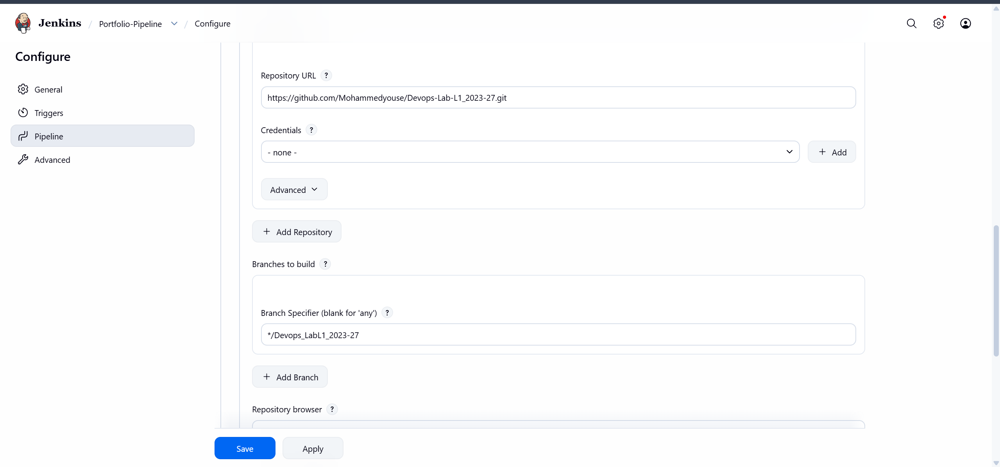
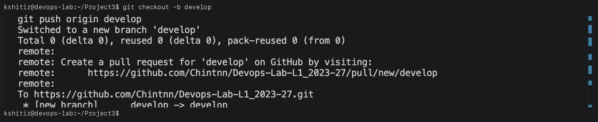
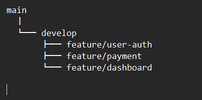
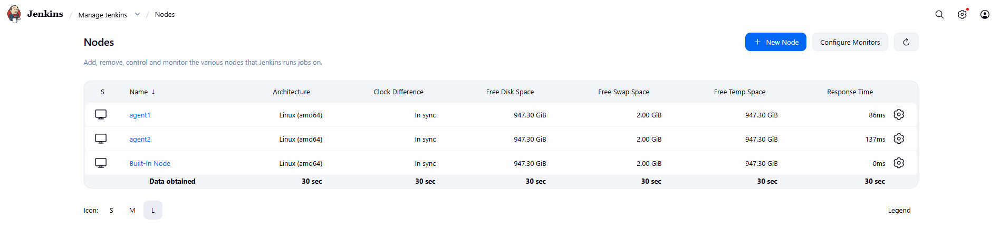
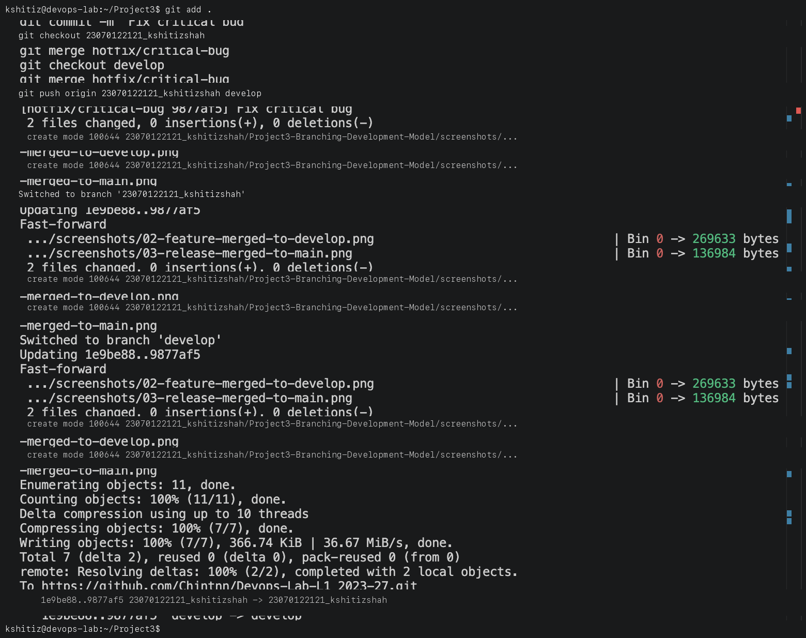

# Project 3: Branching Model and Git Workflow

**Student Name:** Kshitij shah  
**PRN:** 23070122121  
**Course:** DevOps Lab  

---

## 1. Project Overview

This project demonstrates a lightweight, fast-integration branching model based on the **Feature Branch Workflow** (similar to GitHub Flow). This model is designed to help software development teams integrate work faster, reduce merge conflicts, maintain release stability, and improve overall DevOps agility.

---

## 2. The Branching Model

### 1. `main` Branch
- **Purpose**: The `main` branch is the central source of truth containing official, production-ready release history.
- **Rules**:
  - Never commit directly to `main`.
  - All code in `main` must be deployable and pass all automated tests.
  - Changes are integrated into `main` strictly via Pull Requests (PRs) / Merge Requests (MRs).

### 2. Feature Branches (`feature/*`)
- **Purpose**: Used for developing new features and enhancements.
- **Naming Convention**: `feature/<issue-number>-<short-description>` (e.g., `feature/123-user-authentication`).
- **Workflow**:
  - Branch off from: `main`
  - Merge back into: `main`
  - Push frequently to remote feature branch to share progress with CI/CD.

### 3. Bugfix Branches (`bugfix/*` or `hotfix/*`)
- **Purpose**: Used to address non-critical bugs found during development (`bugfix/*`) or critical production issues (`hotfix/*`).
- **Naming Convention**: `bugfix/<issue-number>-<short-description>` or `hotfix/<issue-number>-<description>`.
- **Workflow**:
  - Branch off from: `main`
  - Merge back into: `main`

---

## 3. Workflow Steps for Fast Integration

### Step 1: Sync with Main
Ensure local `main` branch is up to date with the remote repository:
```bash
git checkout main
git pull origin main
```


### Step 2: Create a New Feature Branch
Create a new branch for the feature or bugfix:
```bash
git checkout -b feature/user-authentication
```


### Step 3: Work and Commit Frequently
Make small, atomic commits that explain why changes were made:
```bash
git add .
git commit -m "feat: add initial login form UI"
```


### Step 4: Keep Your Branch Updated (Rebase or Merge)
If `main` has progressed, incorporate upstream changes early to resolve conflicts proactively:
```bash
git fetch origin
git rebase origin/main
# OR
git merge origin/main
```


### Step 5: Push and Open a Pull Request
Push your branch and open a Pull Request against `main`:
```bash
git push -u origin feature/user-authentication
```


### Step 6: Review, CI/CD Verification, and Merge
- Review code with peers.
- Verify automated CI checks pass.
- Merge the Pull Request into `main` and delete the feature branch.

---

## 4. Best Practices for High-Velocity Teams

- **Keep PRs Small**: Aim for pull requests that can be reviewed in under 15 minutes.
- **Short Branch Lifespans**: Avoid long-lived stale branches; merge within a few days.
- **Meaningful Commit Messages**: Follow conventional commits (`feat:`, `fix:`, `docs:`, `test:`).
- **Automated Testing**: Enforce CI pipeline execution on every pull request before merging.
