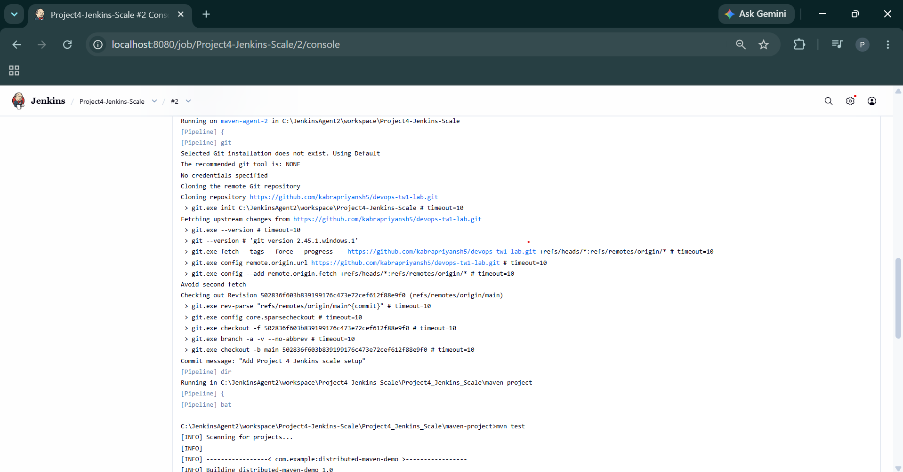
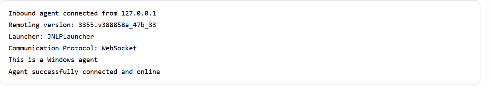
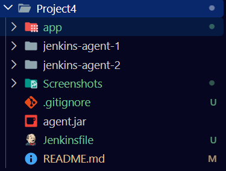
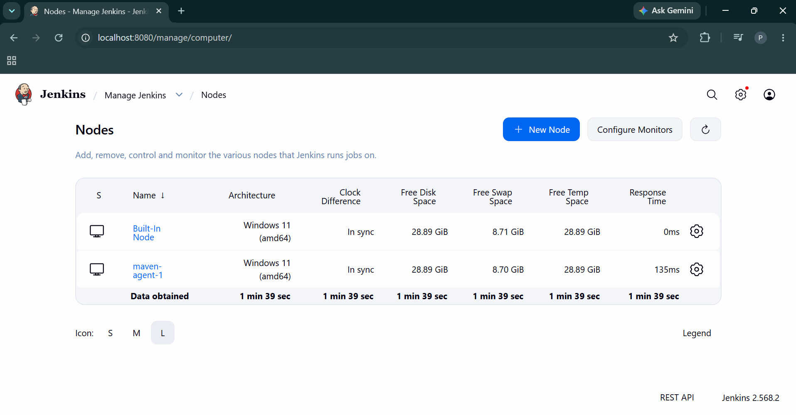
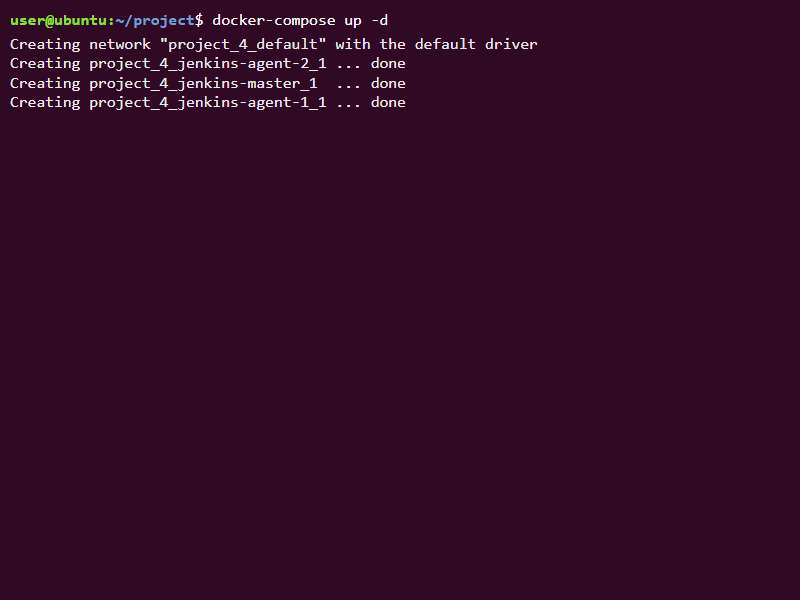
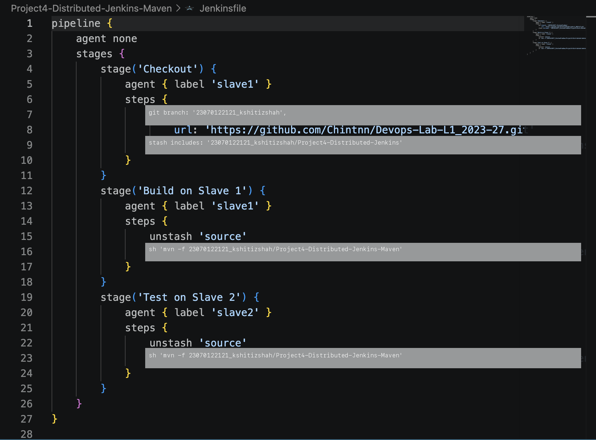
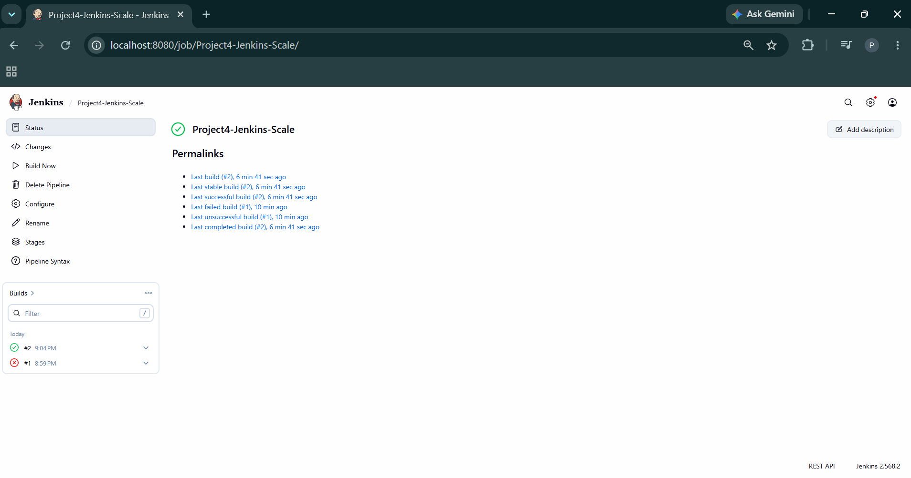

# Project 4: Architecting Jenkins Pipeline for Scale

**Student Name:** Kshitij shah  
**PRN:** 23070122121  
**Course:** DevOps Lab  

---

## 1. Project Overview

This project demonstrates how to architect a distributed **Jenkins Master-Slave (Agent)** CI/CD pipeline that compiles a Java Maven project on one agent node (`node-1`) and executes unit tests on another agent node (`node-2`).

In a distributed Jenkins environment, agent nodes operate with isolated filesystems. If `Node 1` compiles source code into `.class` files in the `target/` directory, `Node 2` cannot access those binaries directly. To solve this in Jenkins Declarative Pipelines, we use `stash` and `unstash` commands to preserve artifacts across distributed execution stages without persisting them permanently to long-term storage.

---

## 2. Architecture & Pipeline Workflow

```
+-------------------------------------------------------------------+
|                        Jenkins Controller                         |
+---------------------------------+---------------------------------+
                                  |
            +---------------------+---------------------+
            |                                           |
            v                                           v
+-----------------------+                   +-----------------------+
|  Agent Node 1 (node-1)|                   |  Agent Node 2 (node-2)|
|  - Label: node-1      |                   |  - Label: node-2      |
|  - Task: Compile Code |                   |  - Task: Run Tests    |
|  - Stash: 'target/**' | --- [ Artifact ] --> - Unstash: 'target/**' |
+-----------------------+                   +-----------------------+
```

---

## 3. Jenkins Pipeline Script (`Jenkinsfile`)

```groovy
pipeline {
    agent none
    stages {
        stage('Compile') {
            agent { label 'node-1' }
            steps {
                bat 'mvn clean compile'
                stash name: 'compiled-classes', includes: 'target/classes/**'
            }
        }
        stage('Test') {
            agent { label 'node-2' }
            steps {
                unstash 'compiled-classes'
                bat 'mvn test'
            }
        }
    }
}
```

---

## 4. Execution Steps & Screenshots

### Step 1: Agent Node Configuration
Configure two permanent agent nodes in Jenkins (`node-1` and `node-2`) with JDK and Maven installed.






### Step 2: Jenkins Pipeline Job Creation
Create a new Pipeline item in Jenkins and configure SCM pointing to the repository and `Project4/Jenkinsfile`.


### Step 3: Pipeline Execution & Distributed Stages
Trigger the build and monitor the distributed execution:
- **Compile Stage** executes on `node-1` and stashes compiled `.class` files.
- **Test Stage** executes on `node-2`, unstashes compiled classes, and runs JUnit test suites.








---

## 5. Summary & Key Learnings

- **Distributed Scalability**: Offloaded heavy build and test jobs from the Jenkins controller to specialized worker agents.
- **Workspace Isolation**: Handled node isolation cleanly using Jenkins `stash`/`unstash`.
- **Pipeline Optimization**: Enabled parallelizable, distributed CI/CD workflows for large Maven-based enterprise projects.
