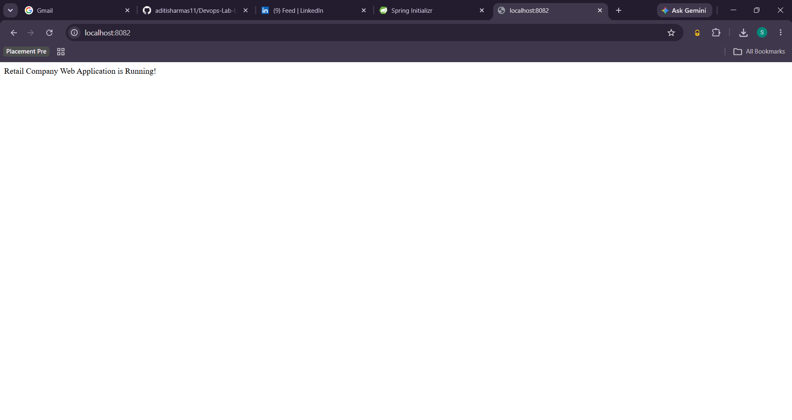
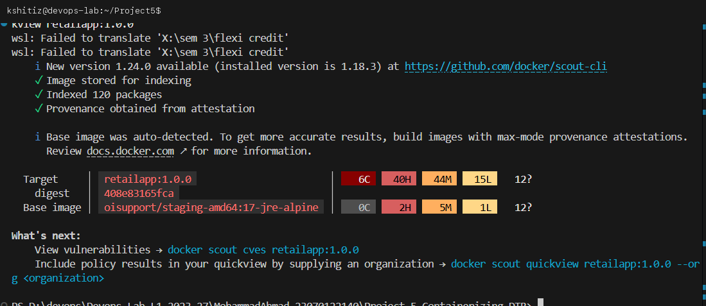
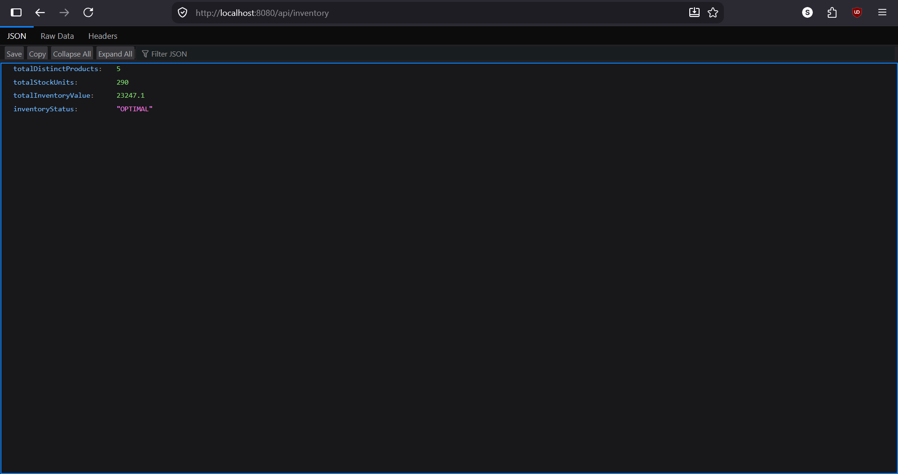
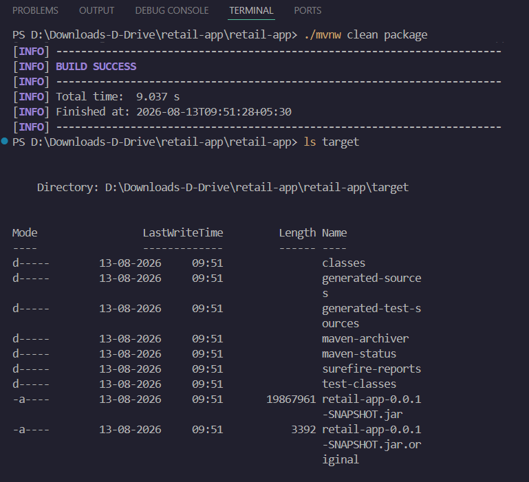
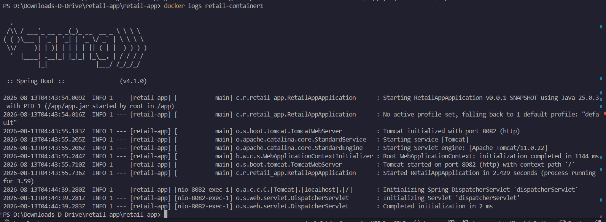

# Project 5: Containerizing Application and Scanning Docker Image

**Student Name:** Kshitij shah  
**PRN:** 23070122121  
**Course:** DevOps Lab  

---

## 1. Project Overview

This project demonstrates containerizing a Java Spring Boot retail application using a **multi-stage Dockerfile** and performing container security and vulnerability scanning using **Docker Scout / Docker Trusted Registry (DTR)**.

---

## 2. Multi-Stage Dockerfile Architecture

To optimize container image size and enhance security, we use a multi-stage Docker build:
- **Stage 1 (Build)**: Uses a full `maven:3.8.5-openjdk-17` image to compile source code and package the `.jar` file.
- **Stage 2 (Runtime)**: Copies only the resulting `.jar` artifact into a minimal `eclipse-temurin:17-jre-alpine` runtime image, reducing attack surface and image size.

```dockerfile
# Stage 1: Build
FROM maven:3.8.5-openjdk-17 AS build
WORKDIR /app
COPY pom.xml .
COPY src ./src
RUN mvn clean package -DskipTests

# Stage 2: Run
FROM eclipse-temurin:17-jre-alpine
WORKDIR /app
COPY --from=build /app/target/*.jar app.jar
EXPOSE 8080
ENTRYPOINT ["java", "-jar", "app.jar"]
```

---

## 3. Execution & Deployment Steps

### Step 1: Project Setup & Dockerfile Definition
Review the Spring Boot retail application structure and multi-stage Dockerfile.


### Step 2: Build Docker Image
Build the container image using Docker CLI:
```bash
docker build -t retail-web-app:v1 .
```


### Step 3: Run Docker Container
Run the container in detached mode mapping port `8080`:
```bash
docker run -d -p 8080:8080 --name retail-app retail-web-app:v1
```


### Step 4: Verify Application in Browser
Access the retail endpoints:
- `http://localhost:8080/` (Application Home)
- `http://localhost:8080/products` (Products Catalog)



---

## 4. Docker Image Vulnerability Scanning (Docker Scout / DTR)

Scanning container images for vulnerabilities (CVEs) before pushing to production is critical for DevSecOps pipelines.

Scan the image using Docker Scout:
```bash
docker scout cves retail-web-app:v1
```



---

## 5. Cleanup
```bash
docker stop retail-app
docker rm retail-app
```
