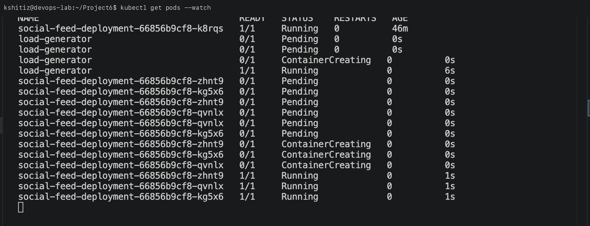
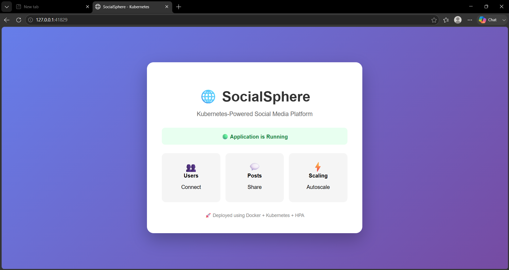
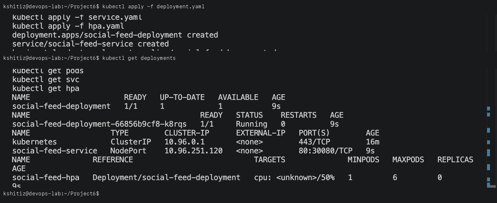

# Project 6: Social Media Infrastructure Scalability using Kubernetes Autoscaling (HPA)

**Student Name:** Kshitij shah  
**PRN:** 23070122121  
**Course:** DevOps Lab  

---

## 1. Project Overview

This project implements **Horizontal Pod Autoscaling (HPA)** in Kubernetes to solve infrastructure scalability challenges for high-traffic social media applications.

When viral posts or unexpected traffic spikes hit the application, Kubernetes HPA monitors CPU consumption across application pods and dynamically scales out the number of replicas (up to 10 pods) to distribute load, and scales down automatically when traffic subsides.

---

## 2. Kubernetes Manifests

### Deployment & Service (`social-media-deployment.yaml`)
```yaml
apiVersion: apps/v1
kind: Deployment
metadata:
  name: social-media-app
spec:
  replicas: 1
  selector:
    matchLabels:
      app: social-media
  template:
    metadata:
      labels:
        app: social-media
    spec:
      containers:
      - name: social-media-container
        image: registry.k8s.io/hpa-example
        ports:
        - containerPort: 80
        resources:
          limits:
            cpu: 500m
          requests:
            cpu: 200m
---
apiVersion: v1
kind: Service
metadata:
  name: social-media-service
spec:
  selector:
    app: social-media
  ports:
  - port: 80
    targetPort: 80
```

### Horizontal Pod Autoscaler (`social-media-hpa.yaml`)
```yaml
apiVersion: autoscaling/v1
kind: HorizontalPodAutoscaler
metadata:
  name: social-media-hpa
spec:
  scaleTargetRef:
    apiVersion: apps/v1
    kind: Deployment
    name: social-media-app
  minReplicas: 1
  maxReplicas: 10
  targetCPUUtilizationPercentage: 50
```

---

## 3. Deployment & Load Testing Steps

### Step 1: Deploy Application and Service
```bash
kubectl apply -f social-media-deployment.yaml
```


### Step 2: Deploy Horizontal Pod Autoscaler (HPA)
```bash
kubectl apply -f social-media-hpa.yaml
kubectl get hpa
```


### Step 3: Generate Traffic Load & Verify Autoscaling
Simulate viral traffic load using a busybox load generator:
```bash
kubectl run -i --tty load-generator --rm --image=busybox:1.28 --restart=Never -- /bin/sh -c "while sleep 0.01; do wget -q -O- http://social-media-service; done"
```

Monitor pod scaling in real time:
```bash
kubectl get hpa -w
kubectl get deployment social-media-app
```


---

## 4. Key Takeaways

- **Resource Limits & Requests**: Configured CPU requests to allow the Kubernetes Metrics Server to compute utilization percentages accurately.
- **Dynamic Elasticity**: Verified automatic scale-out from 1 to multiple replicas during CPU spikes and automatic cooldown scale-down.
