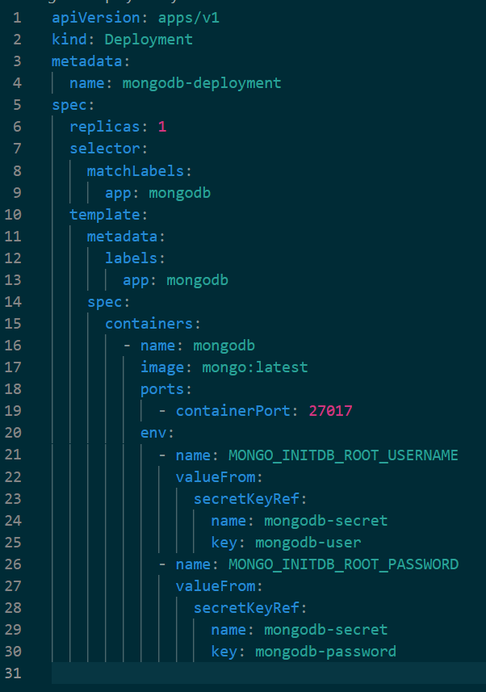
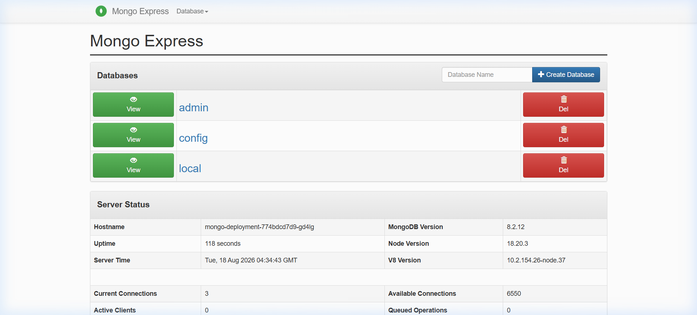
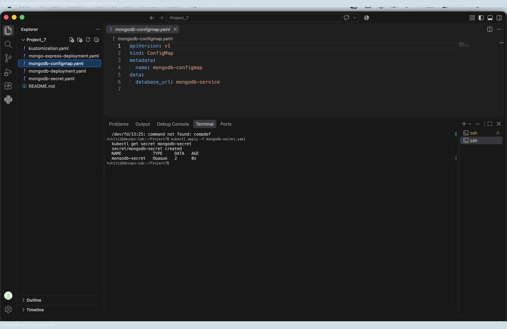
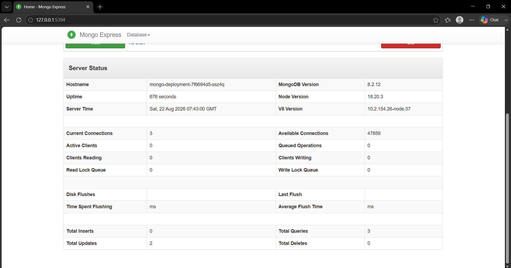

# Project 7: MongoDB & Mongo Express on Kubernetes (ConfigMaps & Secrets)

**Student Name:** Kshitij shah  
**PRN:** 23070122121  
**Course:** DevOps Lab  

---

## 1. Project Overview

This project demonstrates how to decouple application configuration and sensitive credentials from container deployments in Kubernetes using **ConfigMaps** and **Secrets**. We deploy a MongoDB database alongside the Mongo Express web management interface.

---

## 2. Architecture & Components

- **Kubernetes Secret (`mongo-secret.yaml`)**: Securely stores base64-encoded administrative credentials (`mongo-root-username` and `mongo-root-password`).
- **Kubernetes ConfigMap (`mongo-configmap.yaml`)**: Stores non-sensitive internal endpoints (`database_url: mongodb-service`).
- **MongoDB Deployment & Service (`mongo-deployment.yaml`)**: Deploys the database engine with authentication enabled.
- **Mongo Express Deployment & Service (`mongo-express-deployment.yaml`)**: Deploys the web interface exposed via `LoadBalancer` / `NodePort` on port `8081`.

---

## 3. Deployment Steps & Screenshots

### Step 1: Apply Secrets and ConfigMaps
```bash
kubectl apply -f mongo-secret.yaml
kubectl apply -f mongo-configmap.yaml
```


### Step 2: Deploy MongoDB Database
```bash
kubectl apply -f mongo-deployment.yaml
```


### Step 3: Deploy Mongo Express Web UI
```bash
kubectl apply -f mongo-express-deployment.yaml
```


### Step 4: Verify Cluster Resources
```bash
kubectl get pods
kubectl get services
```


### Step 5: Test Web Dashboard
Navigate to `http://localhost:8081` to manage MongoDB databases through Mongo Express.



---

## 4. Cleanup
```bash
kubectl delete -f mongo-express-deployment.yaml
kubectl delete -f mongo-deployment.yaml
kubectl delete -f mongo-configmap.yaml
kubectl delete -f mongo-secret.yaml
```
