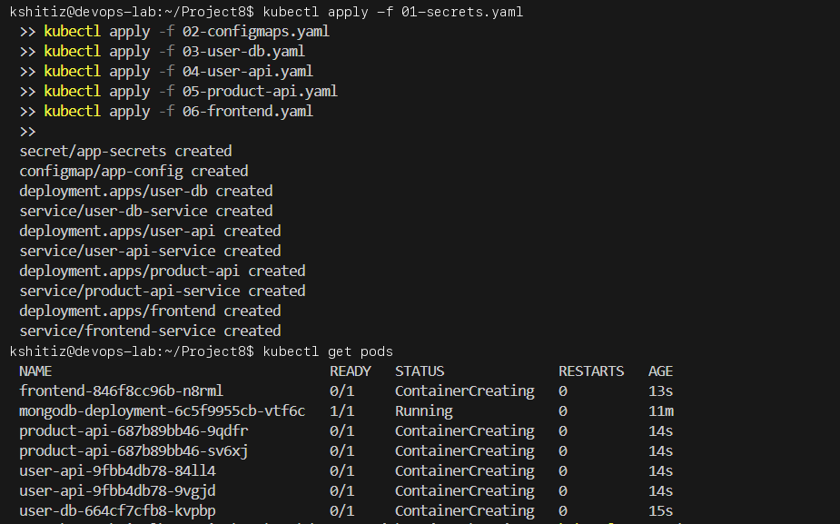
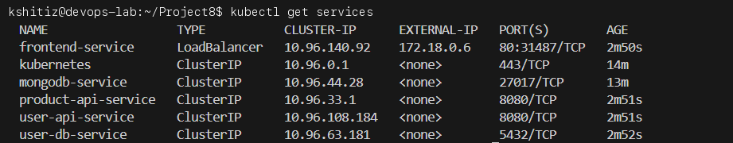
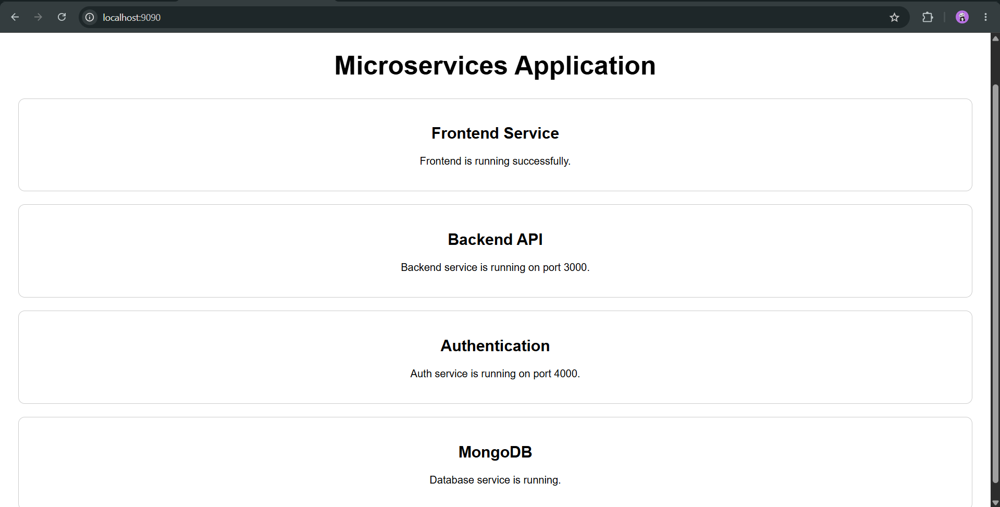

# Project 8: Complete Microservice Architecture on Kubernetes

**Student Name:** Kshitij shah  
**PRN:** 23070122121  
**Course:** DevOps Lab  

---

## 1. Project Overview

This project containerizes and deploys a complete multi-tier e-commerce platform composed of **4 distinct microservices** orchestrated on a Kubernetes cluster.

---

## 2. Microservices Architecture

```
                       +-------------------+
                       |  External Client  |
                       +---------+---------+
                                 |
                                 v
                     +-----------------------+
                     |   Frontend (Nginx)    |
                     |   [LoadBalancer:80]   |
                     +-----+-----------+-----+
                           |           |
            +--------------+           +--------------+
            |                                         |
            v                                         v
+-----------------------+                 +-----------------------+
|      User API         |                 |      Product API      |
|  [ClusterIP:8080]     |                 |   [ClusterIP:8080]    |
+-----------+-----------+                 +-----------------------+
            |
            v
+-----------------------+
|  User DB (PostgreSQL) |
|  [ClusterIP:5432]     |
+-----------------------+
```

1. **Frontend Service (`06-frontend.yaml`)**: Nginx reverse proxy and web UI exposed on port 80.
2. **Product API (`05-product-api.yaml`)**: Go/Node microservice returning product catalog data.
3. **User API (`04-user-api.yaml`)**: Authentication and user management microservice.
4. **User DB (`03-user-db.yaml`)**: PostgreSQL relational database.
5. **ConfigMaps & Secrets (`01-secrets.yaml`, `02-configmaps.yaml`)**: Internal service discovery URLs and database credentials.

---

## 3. Deployment Steps & Screenshots

### Step 1: Deploy Microservice Components in Order
```bash
kubectl apply -f 01-secrets.yaml
kubectl apply -f 02-configmaps.yaml
kubectl apply -f 03-user-db.yaml
kubectl apply -f 04-user-api.yaml
kubectl apply -f 05-product-api.yaml
kubectl apply -f 06-frontend.yaml
```


### Step 2: Verify Pods and Services
```bash
kubectl get pods
kubectl get services
```


### Step 3: Access Frontend Application
Navigate to `http://localhost` in browser to interact with the integrated microservices.



---

## 4. Key DevOps Principles Demonstrated
- **Loose Coupling**: Services communicate over HTTP REST using Kubernetes internal DNS (`http://product-api-service:8080`).
- **Configuration Externalization**: All service URLs and DB secrets stored outside container images.
- **High Availability**: Independent scalability per microservice based on traffic demand.
