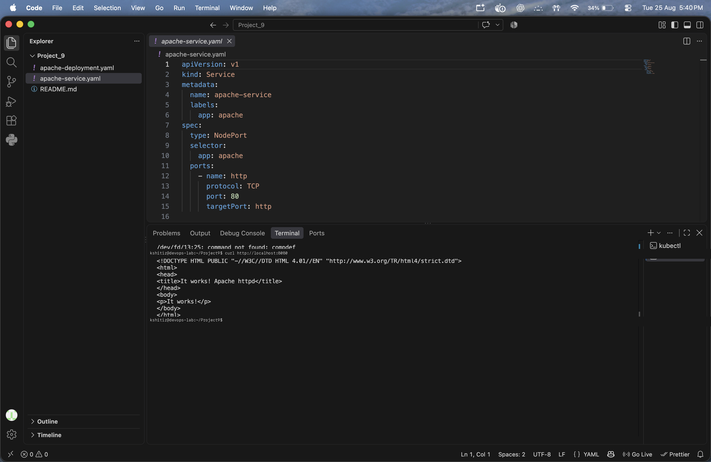
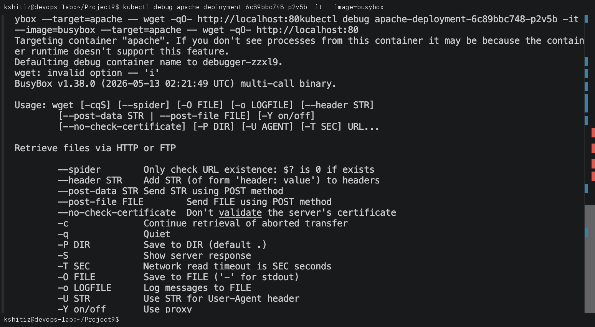

# Project 9: Apache2 Web Server & Host Access on Kubernetes

**Student Name:** Kshitij shah  
**PRN:** 23070122121  
**Course:** DevOps Lab  

---

## 1. Project Overview

This project demonstrates how to deploy an **Apache HTTP Server (`httpd`)** container inside a Kubernetes cluster and access it directly from the host machine using **Kubernetes Port-Forwarding** and **NodePort Services**.

---

## 2. Kubernetes Manifest (`apache-deployment.yaml`)

```yaml
apiVersion: apps/v1
kind: Deployment
metadata:
  name: apache-deployment
spec:
  replicas: 1
  selector:
    matchLabels:
      app: apache-server
  template:
    metadata:
      labels:
        app: apache-server
    spec:
      containers:
      - name: apache-container
        image: httpd:alpine
        ports:
        - containerPort: 80
---
apiVersion: v1
kind: Service
metadata:
  name: apache-service
spec:
  type: NodePort
  selector:
    app: apache-server
  ports:
  - port: 80
    targetPort: 80
    nodePort: 30080
```

---

## 3. Deployment & Access Methods

### Step 1: Deploy Apache Web Server
```bash
kubectl apply -f apache-deployment.yaml
kubectl get pods
kubectl get svc apache-service
```


### Step 2: Host Access

#### Method A: Using `kubectl port-forward` (Direct Tunneling)
```bash
kubectl port-forward service/apache-service 8080:80
```
Open browser at `http://localhost:8080` to view the Apache **"It works!"** page.

#### Method B: Using NodePort Service
Access directly at `http://localhost:30080` without running additional tunnel processes.



---

## 4. Cleanup
```bash
kubectl delete -f apache-deployment.yaml
```
